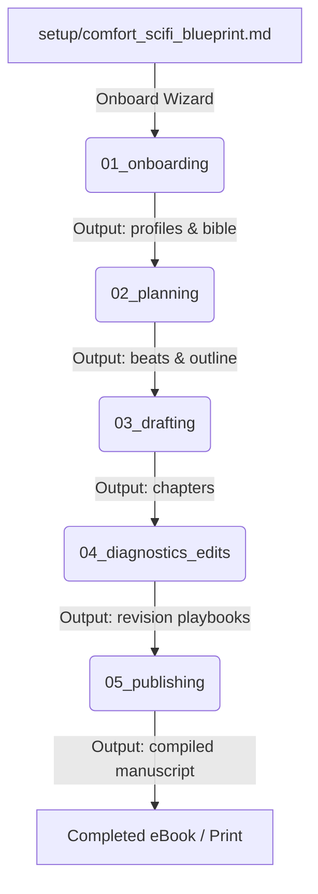

# SAGA-ICM Pipeline Context Routing (Layer 1)

This contract defines the execution flow of the SAGA novel engineering pipeline. Each stage runs sequentially, consumes the outputs of the previous stage, and writes to its own output directory.

## Stage Connection Routing Map

## Stage Registry & Fractal Sub-ICMs

1. **`stages/01_onboarding/`**
   - **Inputs**: `setup/comfort_scifi_blueprint.md` (or other setup questionnaires), `_config/okf_craft/index.md`
   - **Outputs**: `stages/01_onboarding/output/preferences.json`, `stages/01_onboarding/output/bible/`, `stages/01_onboarding/output/characters/`
   - **Fractal Sub-ICM**:
     - `01_intake`: Collect raw input or conduct Path A interview.
     - `02_normalization`: Parse concepts into typed OKF entity files (`type: character`, `type: setting`).
     - `03_trope_assembly`: Map obligatory tropes into the project bible.

2. **`stages/02_planning/`**
   - **Inputs**: `stages/01_onboarding/output/`, `_config/okf_craft/CONTEXT.md`
   - **Outputs**: `stages/02_planning/output/foolscap.md`, `stages/02_planning/output/outline.md`, `stages/02_planning/output/structure_plan.md`, `stages/02_planning/output/beats/`, `manuscript.json`
   - **Fractal Sub-ICM**:
     - `01_macro_arc`: Global logline, theme dialectic, 1-page Foolscap.
     - `02_subplot_mesh`: A/B/C subplots and pacing distribution.
     - `03_obligatory_scenes`: Map and schedule trope ledger scenes.
     - `04_beat_sheets`: Chapter 6-beat sheets with linked OKF entities.

3. **`stages/03_drafting/`**
   - **Inputs**: `stages/02_planning/output/beats/` (via `saga pack-chapter <N>`), `_config/voice.md`
   - **Outputs**: `stages/03_drafting/output/chapters/`
   - **Fractal Micro-ICM**:
     - `01_context_prep`: Run `saga pack-chapter <N>` to prepare minimal context.
     - `02_prose_drafting`: Author solo-drafts or agent drafts against the voice kit.
     - `03_fact_harvest`: Harvest newly established facts to append to canon.

4. **`stages/04_diagnostics_edits/`**
   - **Inputs**: `stages/03_drafting/output/chapters/`
   - **Outputs**: `stages/04_diagnostics_edits/output/reports/`, `stages/04_diagnostics_edits/output/playbooks/`
   - **Fractal Sub-ICM**:
     - `01_mechanical_lint`: 0-token script scan (`saga audit` tells, rhythm CV, dialogue ratio).
     - `02_continuity_audit`: Script scan (`saga continuity`) against OKF entity graph.
     - `03_craft_rubric`: Editorial review of theme suppression and subtext.
     - `04_hitl_playbook`: Synthesize findings into Human-in-the-Loop Revision Playbooks.

5. **`stages/05_publishing/`**
   - **Inputs**: `stages/03_drafting/output/chapters/` (passed verification in 04)
   - **Outputs**: `stages/05_publishing/output/manuscript.html`, `stages/05_publishing/output/manuscript.epub`
   - **Fractal Sub-ICM**:
     - `01_text_assembly`: Concatenate passed chapters into clean manuscript stream.
     - `02_typeset_html`: CSS typography styling for screen/print.
     - `03_epub_format`: Pandoc packaging with ePub metadata and cover art.

