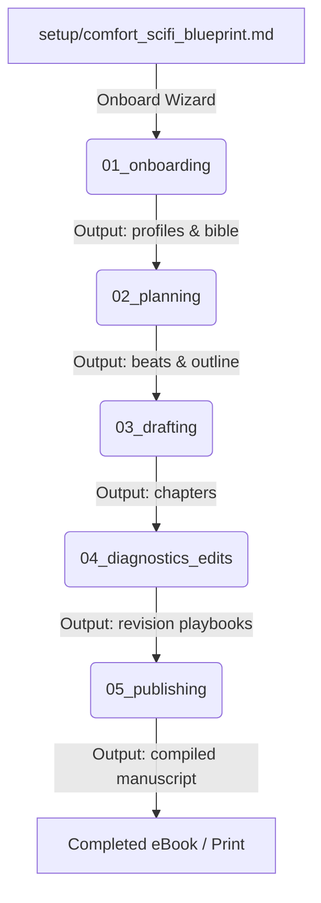

# SAGA-ICM Pipeline Context Routing (Layer 1)

This contract defines the execution flow of the SAGA novel engineering pipeline. Each stage runs sequentially, consumes the outputs of the previous stage, and writes to its own output directory.

## Stage Connection Routing Map

## Stage Registry

1. **`stages/01_onboarding/`**
   - **Inputs**: `setup/comfort_scifi_blueprint.md` (or other setup questionnaires)
   - **Outputs**: `stages/01_onboarding/output/characters/`, `stages/01_onboarding/output/bible/`
   - **Goal**: Establish story bible records, preferences, and style foundations.

2. **`stages/02_planning/`**
   - **Inputs**: `stages/01_onboarding/output/`, `_config/`
   - **Outputs**: `stages/02_planning/output/outline.md`, `stages/02_planning/output/beats/`
   - **Goal**: Design the global outline and chapter beat sheets.

3. **`stages/03_drafting/`**
   - **Inputs**: `stages/02_planning/output/beats/`, `_config/voice.md`
   - **Outputs**: `stages/03_drafting/output/chapters/`
   - **Goal**: Generate high-viscosity prose drafts.

4. **`stages/04_diagnostics_edits/`**
   - **Inputs**: `stages/03_drafting/output/chapters/`
   - **Outputs**: `stages/04_diagnostics_edits/output/reports/`, `stages/04_diagnostics_edits/output/playbooks/`
   - **Goal**: Run diagnostics and copy-editing revisions.

5. **`stages/05_publishing/`**
   - **Inputs**: `stages/03_drafting/output/chapters/` (passed verification in 04)
   - **Outputs**: `stages/05_publishing/output/manuscript.html`, `stages/05_publishing/output/manuscript.epub`
   - **Goal**: Render print layouts and eBook files.
