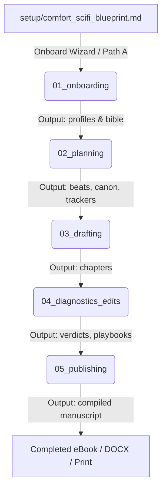

# Soundboard Pipeline Context Routing (Layer 1)

This contract defines the execution flow of the Soundboard novel engineering pipeline. Each stage runs sequentially, consumes the outputs of the previous stage, and writes to its own output directory per Interpretable Context Methodology (ICM).

## Stage Connection Routing Map

## Stage Registry & Artifact Routing

1. **`stages/01_onboarding/`**
   - **Inputs**: `setup/*_blueprint.md`, `_config/okf_craft/index.md`
   - **Outputs**: `stages/01_onboarding/output/preferences.json`, `stages/01_onboarding/output/bible/`, `stages/01_onboarding/output/characters/`, `stages/01_onboarding/output/tell_allowlist.md`
   - **Processes**:
     - `01_intake`: Collect raw material or conduct Path A interview.
     - `02_normalization`: Parse concepts into typed OKF entity files (`type: character`, `type: setting`).
     - `03_trope_assembly`: Map obligatory tropes and trope stack into project bible.

2. **`stages/02_planning/`**
   - **Inputs**: `stages/01_onboarding/output/`, `_config/okf_craft/CONTEXT.md`, `_config/templates/CONTEXT.md`
   - **Outputs**: `stages/02_planning/output/foolscap.md`, `stages/02_planning/output/outline.md`, `stages/02_planning/output/structure_plan.md`, `stages/02_planning/output/beats/`, `stages/02_planning/output/canon.md`, `stages/02_planning/output/trackers/`, `manuscript.json`
   - **Processes**:
     - `01_macro_arc`: Global logline, theme dialectic, 1-page Foolscap.
     - `02_subplot_mesh`: Narrative threads ledger (`trackers/threads.md`) and pacing distribution.
     - `03_obligatory_scenes`: Map and schedule trope ledger scenes.
     - `04_beat_sheets`: Chapter beat sheets with linked entity nodes.

3. **`stages/03_drafting/`**
   - **Inputs**: `stages/02_planning/output/beats/` (via `soundboard pack-chapter <N>`), `_config/voice.md`
   - **Outputs**: `stages/03_drafting/output/chapters/`
   - **Processes**:
     - `01_context_prep`: Run `soundboard pack-chapter <N>` to prepare minimal token-disciplined context kit (<6,000 tokens).
     - `02_prose_drafting`: Author solo-drafts or agent co-drafts against voice kit.
     - `03_fact_harvest`: Harvest newly established facts tagged `[unverified chN]` into canon.

4. **`stages/04_diagnostics_edits/`**
   - **Inputs**: `stages/03_drafting/output/chapters/`
   - **Outputs**: `stages/04_diagnostics_edits/output/reports/`, `stages/04_diagnostics_edits/output/verdicts/`, `stages/04_diagnostics_edits/output/playbooks/`
   - **Processes**:
     - `01_mechanical_lint`: Zero-token script scan (`soundboard audit`, `soundboard continuity`) emitting `scan.json`.
     - `02_canon_verification`: Verify facts against living canon (`canon_check.json`).
     - `03_rubric_audit`: Evaluate narrative authenticity dials and theme suppression (`rubric.json`).
     - `04_trope_delivery`: Obligatory scene ledger delivery proof (`ledger_delivery.json`).
     - `05_gate_authorization`: Run `soundboard gate <chapter>` to formally promote status to `passed`.

5. **`stages/05_publishing/`**
   - **Inputs**: `stages/03_drafting/output/chapters/` (verified via Stage 04 gate proofs)
   - **Outputs**: `stages/05_publishing/output/manuscript.html`, `manuscript.epub`, `manuscript.docx`
   - **Processes**:
     - `01_text_assembly`: Concatenate gated chapters into typeset manuscript.
     - `02_format_export`: Produce HTML, EPUB, or DOCX formats with frontmatter and cover styling.
