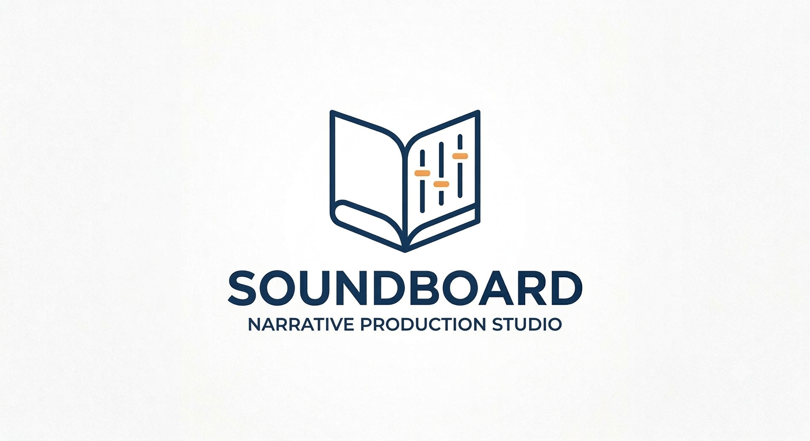
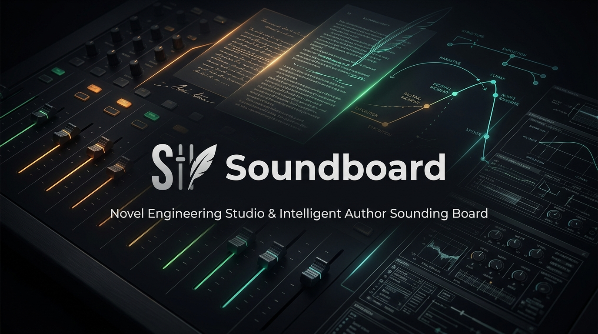
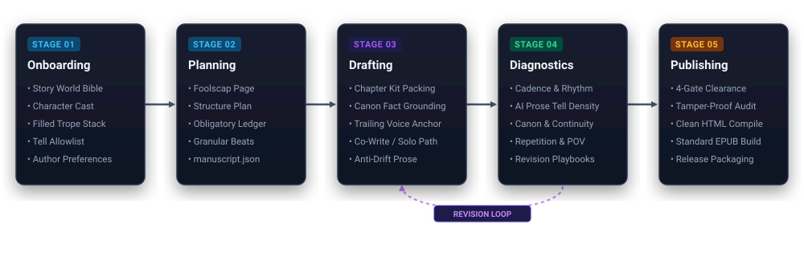
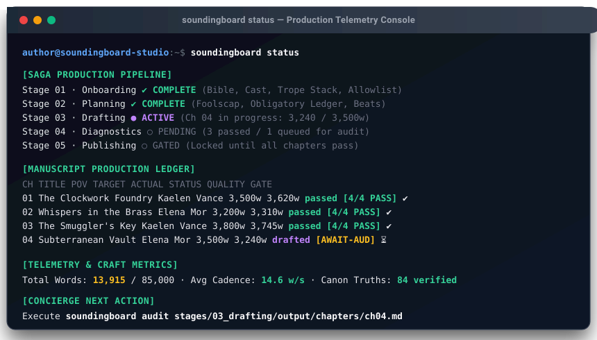
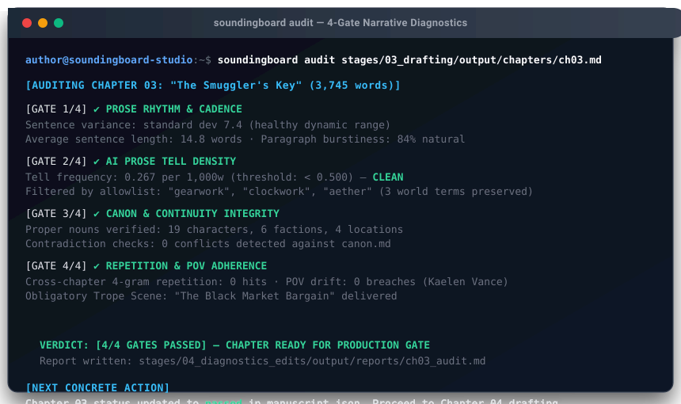

<p align="center">
  
</p>

<h3 align="center">The Author's Intelligent Sounding Board &amp; Novel Production Studio</h3>
<p align="center"><em>Powered by the SAGA Pipeline &amp; Interpretable Context Methodology (ICM)</em></p>

<p align="center">
  <a href="https://github.com/richardelder2/saga-icm/actions"></a>
  <a href="package.json"></a>
  <a href="package.json"></a>
  <a href="https://arxiv.org/abs/2603.16021"></a>
  <a href="_config/okf_craft/"></a>
  <a href="LICENSE"></a>
</p>

---

## What is Soundboard?

Most AI writing tools act like chaotic autocomplete engines: they generate generic, formulaic chapters, hallucinate previously established eye colors, and collapse into melodramatic exposition by Chapter 5.

**Soundboard** turns high-level agent harnesses (**Claude Code, Google Antigravity, Cursor, Gemini CLI**) into an **Executive Novel Writing Concierge**. Built on the **Interpretable Context Methodology (ICM)** and plain-text markdown contracts, Soundboard organizes novel production across 5 disciplined stages—enforcing strict token limits, canonical continuity, voice consistency, and machine-checkable quality gates.

> **Zero framework lock-in.** Plain markdown files, cwd-relative project isolation, zero vector databases, and zero runtime dependencies (`dependencies: {}`).

<p align="center">
  
</p>

---

## The 5-Stage Production Pipeline

<p align="center">
  
</p>

| Stage | What It Produces | Non-Negotiable Contract |
|---|---|---|
| **01 · Onboarding** | Story Bible, Character Cast, Filled Genre Bible & Trope Stack | Creative discovery interview; seeds the in-world tell allowlist. |
| **02 · Planning** | Foolscap Page, Outline, Structure Plan, Scene Beats, `manuscript.json` | Schedules obligatory trope scenes and sets structural authenticity dials. |
| **03 · Drafting** | Canon-consistent, voice-calibrated chapter prose | Packs chapter kits with trailing voice anchors to prevent drift. |
| **04 · Diagnostics** | Mechanical scans, continuity audits, 4-gate verification | Density-normalized AI tell checks, 4-gram repetition detection, and revision playbooks. |
| **05 · Publishing** | Clean HTML / EPUB compilation | Refuses to compile any chapter that has not passed all 4 gate checks. |

---

## Why Soundboard Novels Read Better (The Science)

Research on synthetic narrative detection (*StoryScope*, arXiv:2604.03136) demonstrates that AI-generated stories remain detectable at **~94% accuracy from narrative structure alone**—not just cliché vocabulary.

AI stories fail because of structural tells:
* Unearned character transformations without psychological resistance.
* Uniform scene resolutions where every conflict ends cleanly.
* Single-track plots lacking parallel subplots or thematic foils.
* Narrators who state the theme out loud instead of dramatizing it.

Soundboard defends against both levels:
1. **At Planning Time (Stage 02):** Forces human-typical narrative architecture—nonlinear disclosure, moral ambiguity, 4-corner opposition, and Swain MRU pacing equations.
2. **At Drafting Time (Stage 03):** Calibrates every scene against 92 peer-reviewed craft modules from Shawn Coyne (*Story Grid*), John Truby (*Anatomy of Story*), K.M. Weiland, Virginia Tufte, and Brandon Sanderson.
3. **At Diagnostic Time (Stage 04):** Mechanical regex scanners score lexical tells while checking cross-chapter continuity and N-gram repetition.

---

## Live Console Telemetry

Soundboard includes zero-dependency mechanical CLI tools that report transparent project status, track chapter gates, and surface real-time telemetry:

<p align="center">
  
</p>

### Automated 4-Gate Quality Verification

Before any chapter can compile into the finished manuscript, it must clear 4 machine-audited gates checking prose cadence, AI tell density, canon consistency, and structural POV adherence:

<p align="center">
  
</p>

---

## Quickstart: Choose Your Pathway

### Track A: The Creative Author (Recommended)
You do not need to run terminal commands. Soundboard is designed to be operated by your AI coding assistant:

1. Clone or download this repository.
2. Open the folder in **Claude Code**, **Antigravity**, **Cursor**, or **Gemini CLI**.
3. Say in chat:
   > *"Read AGENTS.md and onboard me for a new novel."*
4. Your agent will act as your Executive Writing Concierge—interviewing your premise, assembling your world bible, and guiding you stage by stage.

---

### Track B: The Command-Line Developer
If you prefer direct CLI control or automated scripting:

```bash
# 1. Clone and install (zero runtime dependencies)
git clone https://github.com/richardelder2/saga-icm.git soundboard
cd soundboard
npm test

# 2. Scaffold a clean project in an empty novel folder
node scripts/soundboard.js init ../my-novel
cd ../my-novel

# 3. Check status, query canon, or run diagnostics
node scripts/soundboard.js status
node scripts/soundboard.js canon query "Mara"
node scripts/soundboard.js audit stages/03_drafting/output/chapters/ch01.md
node scripts/soundboard.js compile
```

---

## The 92-Module OKF Craft Bundle

Soundboard ships with a self-validating, token-disciplined library of **92 narrative craft modules** in `_config/okf_craft/`. Every module adheres to the Open Knowledge Format (OKF):
- Under 900 tokens / 750 words for minimal context consumption.
- Tagged with `stages:`, `subtype:`, and `confidence:` frontmatter.
- Concrete worked examples, formulas, and rubrics preserved intact.
- Features the universal **Narrative Lexicon Rosetta Stone** mapping *Story Grid*, *Save the Cat!*, *Hero's Journey*, *Truby*, and *Dan Harmon* terminology into unified structural mechanics.

---

## Repository Architecture

```
soundboard/
├── AGENTS.md               # Canonical instruction contract for all AI agents
├── _config/                # Layer 3 Context: rules, templates, and 92 craft modules
│   ├── okf_craft/          # Modular craft engines (Coyne, Truby, Weiland, Genette, Tufte)
│   ├── templates/          # Machine-validated artifact skeletons
│   └── narrative_authenticity.md # Structural & prose authenticity rules
├── stages/                 # The 5-stage pipeline with CONTEXT.md contracts
│   ├── 01_onboarding/      # World, characters, trope stacks
│   ├── 02_planning/        # Foolscap, structure plan, scene beats
│   ├── 03_drafting/        # Chapter prose & voice exemplars
│   ├── 04_diagnostics_edits/# Audits, continuity scans, revision playbooks
│   └── 05_publishing/      # Compiled manuscript (HTML/EPUB)
├── scripts/                # Mechanical zero-dependency CLI (Node.js >= 18)
│   ├── soundboard.js       # Core console engine (status, pack-chapter, brief, compile)
│   ├── narrative_audit.js  # Mechanical prose tell scanner
│   ├── okf_lint.js         # Token budget and metadata validator
│   └── saga.js             # Canonical forward CLI shim
└── tests/                  # Cross-platform automated test suite (54+ tests)
```

---

## Contributing & Community

Contributions are welcome! Please ensure:
1. All changes maintain zero runtime dependencies (`dependencies: {}`).
2. New or modified OKF modules pass strict linting: `npm run okf-lint -- --strict`.
3. The full multi-OS test suite passes: `npm test`.

## License
MIT License. Created by Richard Elder & Antigravity. Methodology based on *Interpretable Context Methodology* (Van Clief & McDermott, arXiv:2603.16021).
