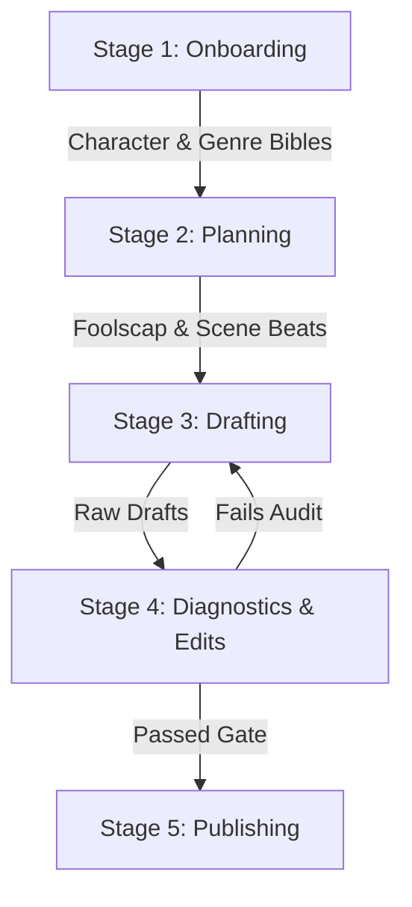
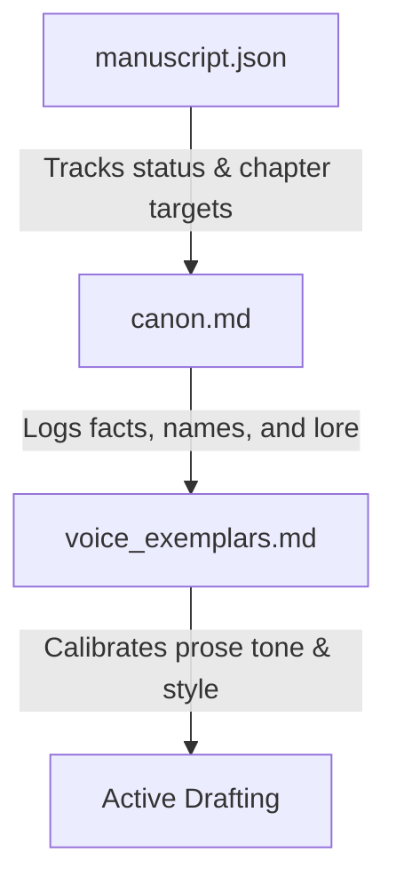

# SAGA-ICM — Novel Engineering Guide
## Welcome to Your AI-Collaborative Writing Workspace

Writing a novel is a deeply personal, messy, and creative process. Standard software engineering processes are too rigid, while standard AI text generators are too formless—often leading to repetitive plots, flat characters, and style drift.

**SAGA-ICM** (Interpretable Context Methodology) is designed to solve this. It is a portable, lightweight framework that transforms your AI coding agent (like Antigravity, Claude Code, or Codex) into a highly disciplined, encouraging writing partner. 

This guide explains how the system works, how your agent supports you, and how the architecture is built to protect and adapt to your creative flow.

---

## 1. How the System Works (The 5 Stages)

SAGA-ICM divides the journey from raw idea to published book into five distinct stages. Each stage has a clear contract (`CONTEXT.md`) that defines the inputs needed and the outputs produced.

| Stage | Folder | What Happens | What it Produces |
| :--- | :--- | :--- | :--- |
| **01. Onboarding** | `stages/01_onboarding/` | Your agent interviews you to map out your world, characters, and genre tropes. | Preferences, World Bible, Character Seeds, Filled Genre Bible. |
| **02. Planning** | `stages/02_planning/` | You map the book onto a single sheet (**Foolscap**), structure subplots, and write chapter-by-chapter beats. | **manuscript.json** (Ledger), Foolscap Page, Scene Beats. |
| **03. Drafting** | `stages/03_drafting/` | You and the agent write the chapter drafts one by one using strict style guidelines. | Chapter Prose (.md files). |
| **04. Diagnostics** | `stages/04_diagnostics_edits/` | The agent audits drafts for continuity and checks for AI tells. | Audit Reports, Continuity Reports. |
| **05. Publishing** | `stages/05_publishing/` | When all chapters pass audits, they compile into a book. | Finished HTML / EPUB manuscript. |

---

## 2. How the Agent Supports You

As a novice user, you don’t need to worry about complex programming, terminal commands, or managing raw configuration files. **Your agent is your interface.**

* **No Terminal Required:** You do not need to run backend setup scripts or manage API configurations. You talk directly to your agent in plain English (e.g., *"Help me draft Chapter 3 beats"* or *"Review my character arcs"*). The agent reads the local contracts, executes the tasks, and updates files for you.
* **The Concierge Persona:** Your agent is contractually instructed to act as a supportive concierge. It will run all code, check state, and audit drafts behind the scenes, presenting results to you in plain, encouraging language and always suggesting the next two concrete steps to take.
* **Creative Sounding Board:** Your agent acts as an encouraging, expert developmental editor. It will push you to flesh out weak plot points, brainstorm alternate angles, and suggest three-dimensional conflicts.
* **The Mechanical Guarddog:** The agent runs local, instant scripts to find typos, detect name spelling inconsistencies, and check for AI-fingerprint phrasing before you compile the book.

---

## 3. Built for the Creative, Non-Linear Mind

Real authors do not write in a perfect straight line. You get sudden inspirations, change your mind about characters, write out of order, or bring half-finished drafts with you. SAGA-ICM's architecture is built specifically to support and protect this creative flexibility.

### 🗺️ A. The Intake Path (Arriving with Existing Material)
If you aren't starting from scratch, you don't have to go through a repetitive setup wizard. 
* **Path C Intake** allows you to feed your existing synopses, outlines, notes, or even pre-drafted chapters to the agent.
* The agent will automatically reverse-engineer the bibles, build the outline, harvest canon facts, and populate `manuscript.json` to match where you are in the project.

### 🔄 B. Out-of-Order Writing (Jumping Around)
If you want to write the climax (Chapter 25) today, you can. 
* SAGA-ICM treats the stage contracts as **gates, not rails**. 
* The system keeps track of status on a per-chapter basis in `manuscript.json` (e.g. Chapter 1: *passed*, Chapter 25: *drafted*, Chapter 2: *planned*).
* While writing out of order raises the auditing burden (more connections to verify in Stage 04), the pipeline allows it naturally.

### 🎭 C. Trope Stacks vs. Authenticity Dials
To write a successful novel, you must satisfy your reader's expectations (tropes) while keeping the prose feeling organic and unpredictable. SAGA-ICM separates these two elements:
1. **The Trope Stack (The Reader Contract):** Obligatory scenes (like the "first meeting" in a romance or the "clue drop" in a mystery) are logged in `structure_plan.md`. The architecture ensures these are **never deleted or subverted**.
2. **Authenticity Dials (The Connective Tissue):** Around those trope scenes, your agent uses adjustable style dials. They introduce subplots, time jumps, moral gray areas, and sensory budgets to make sure the spaces *between* the big beats feel authentic and human.

### 🛡️ D. Redundant Safety Nets (Context Preservation)
To prevent your agent from "forgetting" details or drifting in style, SAGA-ICM deploys three redundant layers of truth:

* **The Production Ledger (`manuscript.json`):** A shared, single file that tracks the entire project state. Any agent can read this file and instantly know the exact status, word count, and next action for the book.
* **The Living Fact Bible (`canon.md`):** Every time a chapter is drafted, the agent harvests new facts (e.g., *"[unverified ch2] Mark has a scar on his left shoulder"*). Once the chapter passes Stage 04, the tag is cleared. This ensures facts remain cohesive across the entire book.
* **The Voice Calibration Kit:** AI text generators tend to slide back toward generic prose. To prevent this, drafting matches your specific style by feeding the agent only the last 500 words of the previous chapter and a short list of *voice exemplars*. This keeps your style perfectly anchored without bloating the AI's memory.

### 🤝 E. Human-in-the-Loop (HITL) Revision Playbooks
Unlike simple generators that silently overwrite text or make arbitrary edits, SAGA-ICM utilizes a collaborative revision process when a chapter fails its audits:
* **The Playbook:** The agent instantiates a custom playbook file (`revision_playbook_ch[X].md`) mapping out audit diagnostics.
* **Options Proposal:** For each issue (e.g., explained theme, low dialogue ratio), the agent suggests 2–3 specific options to fix it.
* **Author Control:** You select the best options or suggest your own changes. The agent compiles these choices into a final approved plan.
* **Execution & Re-Audit:** The agent performs the rewrites and runs a final scan to verify that the chapter has successfully cleared the gate.

### 🏢 F. Turnkey Zero-Bloat Workspaces
To make starting a new book as seamless and turnkey as moving into a fully furnished apartment:
* **One-Step Setup:** Running `saga init` inside any empty folder sets up everything you need in seconds.
* **Smart Linking (Junctions & Symlinks):** SAGA-ICM automatically links the core logic and templates (`scripts`, `setup`, `.claude`) back to your central template folder.
* **Zero Disk Bloat & Instant Upgrades:** Your new book folder only holds your actual writing. Plus, if the main SAGA code is updated or fixed, all your active book projects are upgraded instantly with zero action required on your part.
* **Frictionless Fallback:** If your operating system blocks directory linking, SAGA-ICM silently falls back to standard physical copies. It "just works" regardless of your technical settings.

---

## 4. Quick Commands to Tell Your Agent

To get started, simply type these prompts in your chat with the agent:
* **To start the project:** *"Read AGENTS.md and onboard me for a new novel using Path A."*
* **To check progress:** *"Run saga status and tell me what chapter needs work next."*
* **To start drafting:** *"Let's build the drafting kit for Chapter [X] and write it."*
* **To review your work:** *"Audit my draft for Chapter [X] and show me the reports."*
