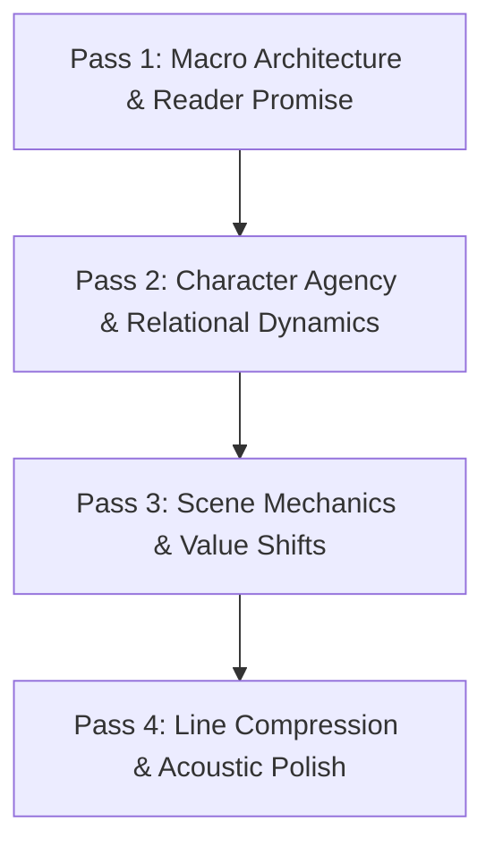

# Developmental Revision: The Layered Macro-to-Micro Pass Methodology

Never attempt to fix grammar, character motivation, plot logic, and prose cadence in a single chaotic reading pass. Cognitive overload guarantees that structural flaws will be missed while polishing sentences that should be cut entirely.

Revision must proceed in disciplined, descending layers.

---

## 1. The 4 Descending Revision Passes

### Pass 1: Macro Architecture & Reader Promise
*   **Focus:** Core premise, obligatory trope delivery, pacing contours, act climaxes.
*   **Key Question:** Does the story deliver on the premise promised on page one? Are there redundant subplots or dead-end arcs?
*   **Rule:** If a scene does not advance the plot or reveal essential character change, mark it for deletion before touching prose.

### Pass 2: Character Agency & Relational Dynamics
*   **Focus:** Moral ambivalence, motivation consistency, anti-default reactions.
*   **Key Question:** Is the protagonist driving action, or merely reacting to a tour of plot events? Do relationships evolve or stagnate?

### Pass 3: Scene Mechanics & 5 Commandments
*   **Focus:** Inciting incident, turning point, crisis dilemma, climax, resolution.
*   **Key Question:** Does every scene execute a clear value shift (+ to -, or - to +)? If a scene begins with tension and ends in the same tension without irreversible change, it is dead weight.

### Pass 4: Line Compression & Prose Authenticity
*   **Focus:** AI tell suppression, dialogue subtext, sentence length variance, sensory anchoring.
*   **Key Question:** Can three sentences be compressed into one punchy verb? Are embodied cliches eliminated?

---

## 2. Beta Reader & Critique Triage Matrix

When receiving external critique:
*   **The Neil Gaiman Axiom:** "Remember: when people tell you something's wrong or doesn't work for them, they are almost always right. When they tell you exactly what they think is wrong and how to fix it, they are almost always wrong."
*   **Cluster Rule:** If one reader flags a scene as slow, observe it. If three readers flag it, cut or restructure it immediately.
